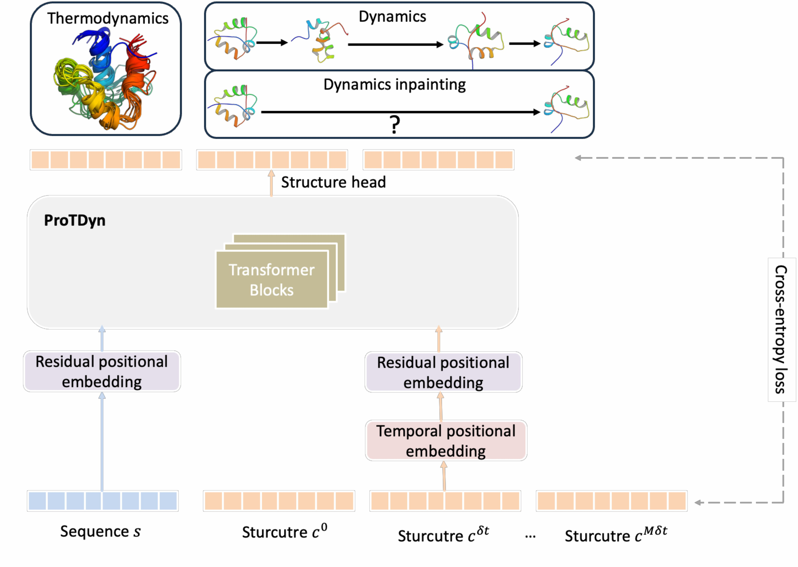

# ProTDyn: generative modeling of Protein Thermodynamcis and Dynamics

[](LICENSE)
[]()
[]()
[](https://arxiv.org/abs/XXXX.XXXXX)

---

## ✨ Overview

**ProTDyn** is a unified framework for generative modeling of Protein Thermodynamics and Dynamics that efficiently generates equilibrium conformational ensembles and transitions, capturing both **thermodynamic distributions** and **dynamic pathways**. It supports three sampling modules:  
  - `thermodynamics` → i.i.d. sampling of protein conformation ensembles.  
  - `dynamics` → molecular dynamics simulations with flexible timestep (1 - 100 ns).  
  - `dynamics inpainting` → refining large-timestep trajectories by recovering fine-grained, physically plausible dynamic pathways. 


---
## Table of Contents
- [Installation](#-installation)
- [How to Run](#️-how-to-run)
  - [0. Hugging Face Setup](#0-hugging-face-setup)
  - [1. Run with Config File](#1-run-with-config-file)
    - [1.1 Equilibrium Conformation Ensemble Generation](#11-equilibrium-conformation-ensemble-generation)
    - [1.2 Dynamic Simulation](#12-dynamic-simulation)
    - [1.3 Dynamic Inpainting](#13-dynamic-inpainting)
  - [2. Run with Python API](#2-run-with-pyhon-api)
- [Citation](#-citation)
- [Contact](#-contact)
- [License](#-license)

## 🛠 Installation

Clone this repository and create a conda environment:

```bash
git clone https://github.com/Harrydirk41/ProTDyn.git
cd ProTDyn

conda env create -f environment.yml
conda activate ProTDyn
```
---

## ▶️ How to Run
### 0. Hugging Face Setup
ProTDyn relies on ESM3 for tokenization. Before running anything, you need to authenticate with Hugging Face to use ESM3. Please refer to https://huggingface.co/EvolutionaryScale/esm3-sm-open-v1 and https://github.com/evolutionaryscale/esm for obtaining tokens

1. **Create a Hugging Face account**  
   [https://huggingface.co/join](https://huggingface.co/join)

2. **Generate a token**  
   Go to https://huggingface.co/EvolutionaryScale/esm3-sm-open-v1 and follow instructions.

3. **Log in (one-time setup)**  
   Run in your terminal and paste your token when prompted:
   ```bash
   huggingface-cli login
### 1. Run with Config File

This guide explains how to run **equilibrium ensemble generation**, **dynamic simulation**, and **dynamic inpainting** using ProTDyn.  
All sampling modes are configured through YAML files in the `sample_config/` directory.


#### 1.1 Equilibrium Conformation Ensemble Generation

Edit: `sample_config/thermo_config.yml`

- **sequence / pdb_file**  
  - You can either set your protein sequence directly or provide a PDB file.  

- **num_sample**  
  - Number of conformations to generate.  

- **batch_size**  
  - Adjust based on available GPU memory.  

- **ckpt_dir**  
  - Path to store/download the pretrained checkpoint (≈16 GB on first run).  

- **sample_dir**  
  - Directory to save generated ensembles.  

Finally, run: 
```bash
python sample.py --config sample_config/thermo_config.yml
```

#### 1.2 Dynamic Simulation

Edit: `sample_config/dynamics_config.yml`

- **use_initial_struc**  
  - `true`: start from your own initial structures.  
  - `false`: start from randomly sampled structures.  

- **pdb_dir / xtc_dir**  
  - Required if `use_initial_struc=true`.  

- **num_sample**  
  - Number of independent trajectories.  
  - If using initial structures, total trajectories = `num_sample × num_initial_struc`.  

- **timestep**  
  - Simulation resolution in nanoseconds.  
  - Recommended values: `1`, `10`, or `100` ns to explore short- and long-timescale transitions.  

- **num_step**  
  - Number of steps per trajectory.  

- **batch_size**  
  - Recommended: `1` or `2` for dynamics mode (due to GPU memory limits).  

Finally, run: 
```bash
python sample.py --config sample_config/dynamics_config.yml
```

#### 1.3 Dynamic Inpainting

Edit: `sample_config/dynamics_inpaint_config.yml`

- **pdb_dir / xtc_dir**  
  - Input MD trajectories (used as reference frames).  

- **num_sample**  
  - Number of inpainted trajectories per two consecutive frames.  
  - Total generated = `num_sample × num_two_consecutive_frames`.  

- **timestep / num_step**  
  - Define resolution of inpainting relative to your MD frames.  
  - Example:  
    - If MD frames are saved at 0, 9, 19, … ns, and you want 1 ns inpainting:  
      - `timestep = 1`  
      - `num_step = 10` (since 9–0+1 = 10).


Finally, run: 
```bash
python sample.py --config sample_config/dynamics_inpaint_config.yml
```

#### Notes
- The first run will automatically download a ~16 GB checkpoint into `ckpt_dir`.  
- Adjust `num_sample` and `batch_size` based on GPU memory.  
- For dynamics, combining timesteps (1 ns, 10 ns, 100 ns) is often sufficient to cover both short- and long-timescale transitions.


### 2. Run with Pyhon API:
Alternatively, you can use the Python API:
```python
from sample import sample

sample(tag="thermo", num_sample=1000, batch_size=4, pdb_dir="./protein.pdb")
```


## 📖 Citation

Paper coming soon!

---

## 📬 Contact

For questions, issues, or collaborations, please reach out:  

**Yikai (Harry) Liu**  
📧 liu3307@purdue.edu    

---

## 📜 License

This repository is licensed under the [MIT License](LICENSE).
